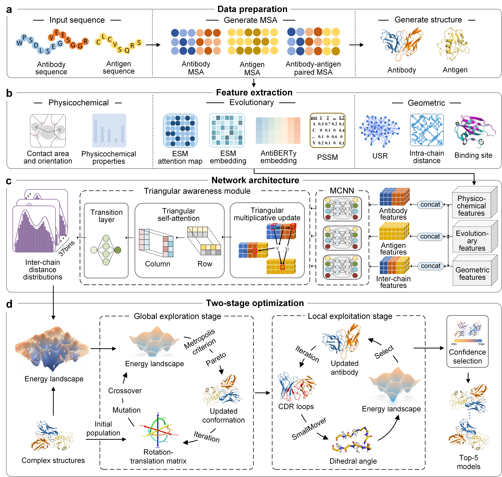

# DeepAAAssembly

DeepAAAssembly is a computational protocol designed for antibody-antigen complex structure modeling. The framework integrates deep learning-based inter-chain residue distance prediction with a Monte Carlo conformational sampling scheme to generate accurate binding conformations. Specifically, the predicted distance maps serve as knowledge-based energy constraints that guide sampling toward physically plausible configurations. To efficiently explore the conformational landscape, the protocol adopts a two-stage exploration-exploitation strategy. In the exploration stage, diverse binding orientations are extensively sampled under the guidance of the energy landscape. In the subsequent exploitation stage, local structural refinement of the CDR loops is performed to optimize geometric and energetic complementarity at the interface. This pipeline thus provides a unified and data-driven approach for predicting, sampling, and refining antibody-antigen interactions.

## 📬 Contact (Supervisor)

**Prof. Guijun Zhang**  
College of Information Engineering  
Zhejiang University of Technology, Hangzhou 310023, China  
✉️ Email: [zgj@zjut.edu.cn](mailto:zgj@zjut.edu.cn)

## ⭐**Overall workflow for the DeepAAAssembly**⭐


## 1.🛠**Download DeepAAAssembly package**

```
git clone --recursive https://github.com/iobio-zjut/DeepAAAssembly 
```
- **Download [the pretrained model weights](https://github.com/iobio-zjut/DeepAAAssembly/releases/tag/v1.0.0) used in DeepAAAssembly.**

- **Add the download file** `best.pkl` to `/DeepAAAssembly_main/distance/save_model`.

## 2.📥**Installation**

### **Third-Party Software Used**
- **AlphaFold3** ([GitHub](https://github.com/google-deepmind/alphafold3)) | [CC-BY-NC-SA-4.0](https://creativecommons.org/licenses/by-nc-sa/4.0/legalcode)
- **AntiBERTy** ([GitHub](https://github.com/jeffreyruffolo/AntiBERTy)) | [MIT](https://opensource.org/license/mit)
- **Voronota** ([GitHub](https://github.com/kliment-olechnovic/voronota?tab=MIT-1-ov-file)) | [MIT](https://opensource.org/license/mit)
- **PeSTo** ([GitHub](https://github.com/LBM-EPFL/PeSTo)) | [CC-BY-NC-SA-4.0](https://creativecommons.org/licenses/by-nc-sa/4.0/legalcode)
- **Rosetta** ([Version-2021.16](https://downloads.rosettacommons.org/downloads/academic/))  | [Academic License (non-commercial use only)](https://github.com/RosettaCommons/rosetta/blob/main/LICENSE.md)
- **ESM-MSA-1b** ([Download](https://dl.fbaipublicfiles.com/fair-esm/models/esm_msa1b_t12_100M_UR50S.pt)) | [MIT](https://opensource.org/license/mit)
- Add the download file `esm_msa1_t12_100M_UR50S.pt` to `/DeepAAAssembly_main/distance/data/feature/bin/esm_pretrain_models`.
- **UniRef30** ([Database](https://uniclust.mmseqs.com/)) | [AGPL-3.0 license](https://www.gnu.org/licenses/agpl-3.0.en.html)
- Add the download file path `UniRef30_2021_03` to `/DeepAAAssembly_main/distance/data/uniref30_former/UniRef30_2021_03`.

(The above paths can be modified in `/DeepAAAssembly_main/distance/data/feature/set_env.sh`)

### **Create a new conda environment and update**

``` 
conda create --n deepaaassembly python==3.7
conda activate deepaaassembly
```

### **Install dependencies**

```
biopython==1.78
fair-esm==2.0.0
numpy==1.18.5
pandas==1.3.5
scikit-learn==1.0.2
scipy==1.7.3
torch==1.13.0+cu116
torchvision==0.14.0+cu116
torchaudio==0.13.0+cu116
tqdm==4.63.1
openpyxl==3.1.2
gemmi==0.6.3
```
- Install AntiBERTy
```
$ git clone git@github.com:jeffreyruffolo/AntiBERTy.git 
$ pip install AntiBERTy
```
## 3.💻**Recommended Hardware Requirements**

For reproducibility and practical usability, all experiments in this work were conducted on a single NVIDIA A100 GPU with up to 80 GB GPU memory and 20 CPU cores per task.

The recommended hardware configuration for running DeepAAAssembly is:

- GPU: NVIDIA A100 (80 GB memory recommended)
- CPU: ≥20 CPU cores
- Operating system: Linux

## 4.📦**Data Preparation**
### **Download Data**

- The antibody-antigen complex structure database used by DeepAAAssembly can be accessed from [**SAbDab**](https://opig.stats.ox.ac.uk/webapps/sabdab-sabpred/sabdab)

You can choose structures with **IMGT** numbering for download and obtain the corresponding annotation file **`summary.tsv`**.

### **Data Preprocessing**
- Firstly, enter the working directory
```
cd ./your_work_dir/DeepAAAssembly_main
```
- Run the following script to preprocess the native PDB files. This script takes a **`.pdb`** as input and, based on the information in **summary.tsv**, splits chain pairs and extracts **labels** and **masks** into **`./distance/data/label`** and **`./distance/data/mask`** directories.
```bash
bash ./distance/data/utils/process_pdb.sh
```

### **Feature Generation**
- Run the following script to generate features. It reads the antibody/antigen **`.pdb`** files produced during the data preprocessing stage, generates all corresponding feature files, and packages them into the final **`.npz`** file.

```bash
bash ./distance/data/features/generate_npz_file.sh ./distance/data/dataset
```
## 5.🚀**Predicted inter-chain distance maps**

- Run the following script; it will output the predicted distances to the **`./distance/predict/output`** directory.

```bash
bash ./distance/predict/run_predict.sh
```
## 6.🧩**Conformation Sampling**
After installing Rosetta,

- copy **`complex_assembly.cc`** and **`pareto.hh`** from **`./simulation/rosetta_src_2021.16.61629_bundle/`** to **`./simulation/rosetta_src_2021.16.61629_bundle/main/source/src/apps/public/complex_assembly`**.
- copy **`coupled_moves.cc`** to **`./simulation/rosetta_src_2021.16.61629_bundle/main/source/src/apps/public/coupled_moves`**,

and run the compilation script.
```bash
cd ./simulation/rosetta_src_2021.16.61629_bundle/main/source
bash ./simulation/rosetta_src_2021.16.61629_bundle/main/source/compile.sh
```
### **The Global-exploration stage**
- Run the following script to perform Global-exploration sampling.
```bash
bash ./simulation/run_rosetta/DB5.5/stage_1/run_stage_1.sh
```
- If you wanna to see the complex structure out of **stage_1** , run the following script
```
bash ./simulation/run_rosetta/utils/process.sh
```
### **The Local-exploitation stage**
- Run the following script to perform Local-exploitation sampling.
```bash
bash ./simulation/run_rosetta/DB5.5/stage_2/run_stage_2.sh
```
